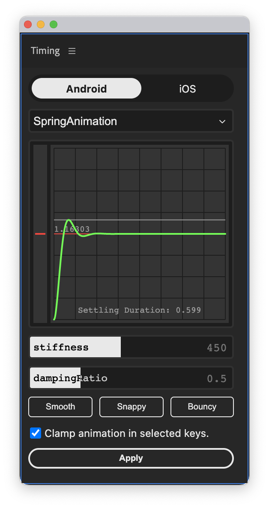

# Timing - CEP

An Adobe After Effects extension that provides handy expressions for universal timing functions, compatible with Android, iOS, and web platforms.

## Installation

1. [Download the ZIP file](https://github.com/lixiaolin94/timing-cep/raw/master/Timing.zip)
2. Unzip to retrieve the .zxp file
3. Use the [ZXP installer](https://aescripts.com/learn/zxp-installer/) from aescripts.com for installation

## Compatibility

- Supports [Adobe After Effects](https://www.adobe.com/products/aftereffects.html) (version 2022 or newer)
- Available for Windows and macOS
